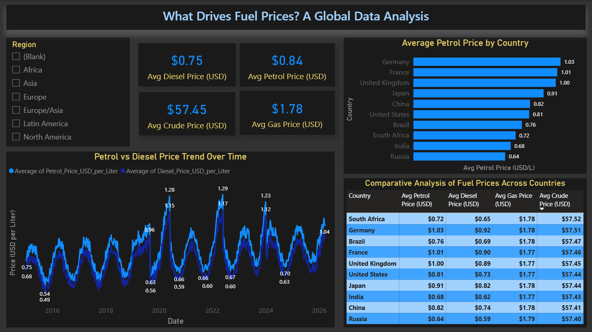
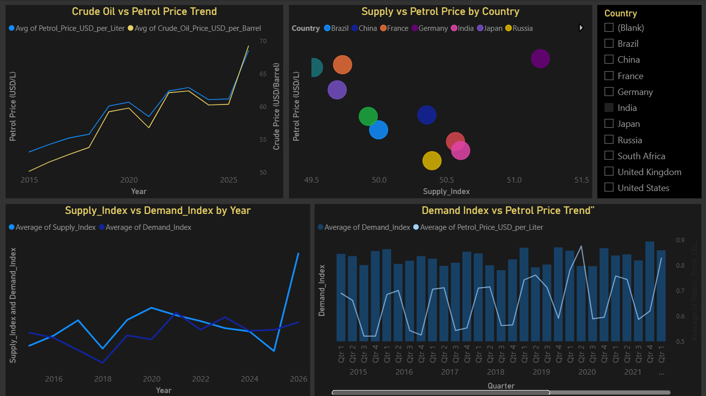
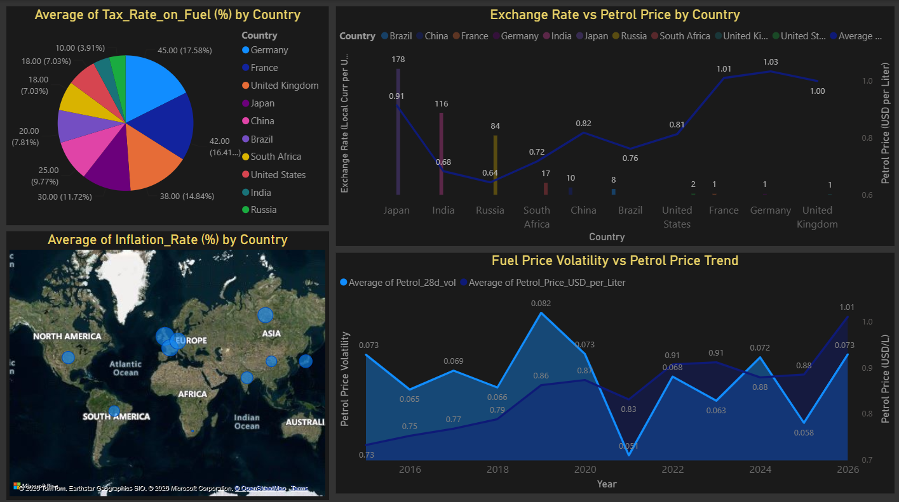
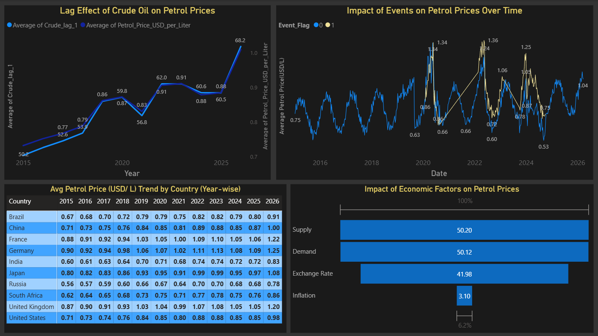
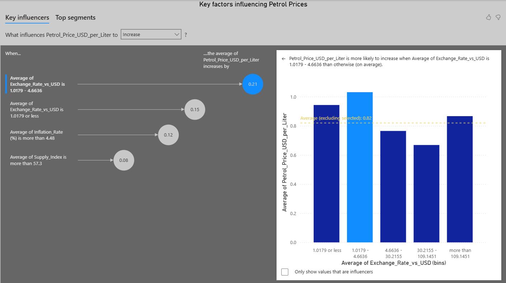

# 🌍 Global Fuel Price Analysis Report

## 📌 Project Overview

The **Global Fuel Price Analysis Report** is an interactive Power BI report designed to analyze fuel price trends across different countries and understand the economic and market factors influencing petrol prices.

The report combines historical fuel prices with macroeconomic indicators such as inflation, exchange rates, supply-demand dynamics, taxation, and global events to provide meaningful business insights.

---

# 🎯 Objectives

- Analyze global fuel price trends over time.
- Compare petrol, diesel, gas, and crude oil prices across countries.
- Study the impact of economic indicators on fuel prices.
- Identify key drivers influencing petrol prices.
- Build an interactive Power BI report for business decision-making.

---

# 🛠️ Tools & Technologies

- Microsoft Power BI
- Power Query
- DAX (Data Analysis Expressions)
- Data Modeling
- Interactive Visualizations

---

# 📊 Report Pages

## 📄 Page 1 – Fuel Price Overview

Features:
- KPI Cards
  - Average Petrol Price
  - Average Diesel Price
  - Average Gas Price
  - Average Crude Oil Price
- Petrol vs Diesel Price Trend
- Country-wise Petrol Price Comparison
- Comparative Fuel Price Table
- Region Filter

### Report Preview



---

## 📄 Page 2 – Supply & Demand Analysis

Features:
- Crude Oil vs Petrol Trend
- Supply vs Petrol Price
- Supply Index vs Demand Index
- Demand Index vs Petrol Price
- Country Filter

### Report Preview



---

## 📄 Page 3 – Economic Indicators

Features:
- Fuel Tax Analysis
- Exchange Rate Analysis
- Inflation Map
- Fuel Price Volatility

### Report Preview



---

## 📄 Page 4 – Advanced Analytics

Features:
- Lag Effect of Crude Oil
- Event Impact Analysis
- Economic Factor Comparison
- Year-wise Country Comparison

### Report Preview



---

## 📄 Page 5 – Key Influencers

Features:
- AI-powered Key Influencers Visual
- Factors increasing Petrol Prices
- Exchange Rate Impact
- Inflation Impact
- Supply Index Analysis

### Report Preview



---

# 📈 Key KPIs

- Average Petrol Price
- Average Diesel Price
- Average Gas Price
- Average Crude Oil Price
- Supply Index
- Demand Index
- Inflation Rate
- Exchange Rate
- Fuel Tax Rate

---

# 🌎 Dataset Features

The report analyzes:

- Country
- Region
- Date
- Petrol Price
- Diesel Price
- Gas Price
- Crude Oil Price
- Inflation Rate
- GDP Growth
- Exchange Rate
- Fuel Tax Rate
- Supply Index
- Demand Index
- Event Flag
- Currency Devaluation

---

# 💡 Key Business Insights

- Petrol and diesel prices show a strong positive correlation, indicating both fuels are driven by similar market forces such as crude oil prices, global demand, and taxation.

- Germany and France recorded the highest average petrol prices due to higher fuel taxes and stricter environmental policies, while Russia and India maintained comparatively lower prices.

- Although crude oil prices remain relatively similar across countries, retail fuel prices vary significantly because of government taxation, subsidies, and economic policies.

- Petrol prices closely follow crude oil price movements, but with a noticeable time lag due to refining, transportation, and pricing mechanisms.

- Supply has the strongest influence on petrol prices, followed by demand, whereas inflation has the least impact among the economic factors analyzed.

- Fuel demand remains relatively stable despite price fluctuations, demonstrating that petrol is a price-inelastic commodity driven more by necessity than price.

- Global events such as the COVID-19 pandemic and supply disruptions caused temporary spikes in fuel price volatility, followed by gradual market stabilization.

- India's fuel market demonstrates managed price stability, where government taxation and policy interventions reduce the direct impact of global crude oil price changes on retail fuel prices.

---

# 💼 Skills Demonstrated

- Data Cleaning
- Data Modeling
- Power Query
- DAX Measures
- KPI Design
- Time Series Analysis
- Geographic Analysis
- Interactive Report Development
- Business Intelligence
- Data Storytelling

---

# 🚀 Future Improvements

- Live API integration for real-time fuel prices.
- Forecasting using Power BI forecasting visuals.
- Additional country-level drill-through reports.
- Mobile-optimized report layout.

---

# 📷 Project Structure

```text
global-fuel-price-analysis-powerbi/
│
├── LICENSE
├── README.md
├── Global_Fuel_Price_Analysis_Report.pbix
└── images/
    ├── page1.png
    ├── page2.png
    ├── page3.png
    ├── page4.png
    └── page5.png
```

---

## 👨‍💻 Author

**Saish Jagtap**

Computer Engineering Graduate

Mumbai University
